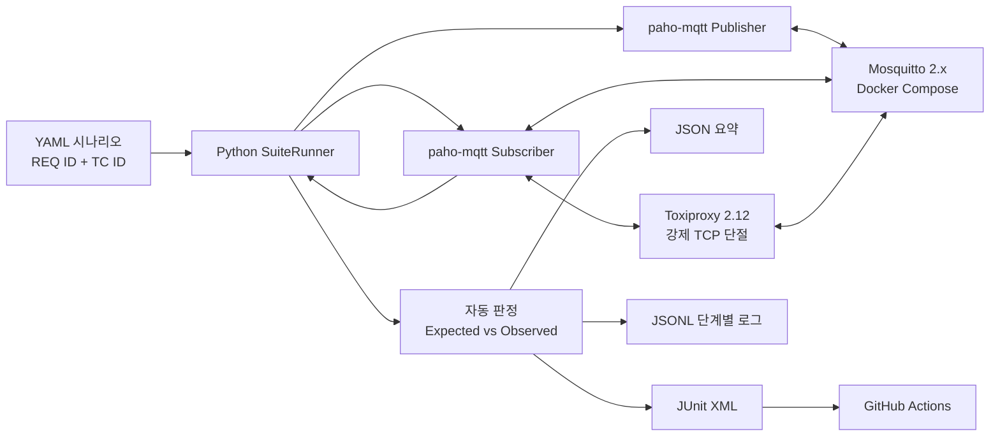
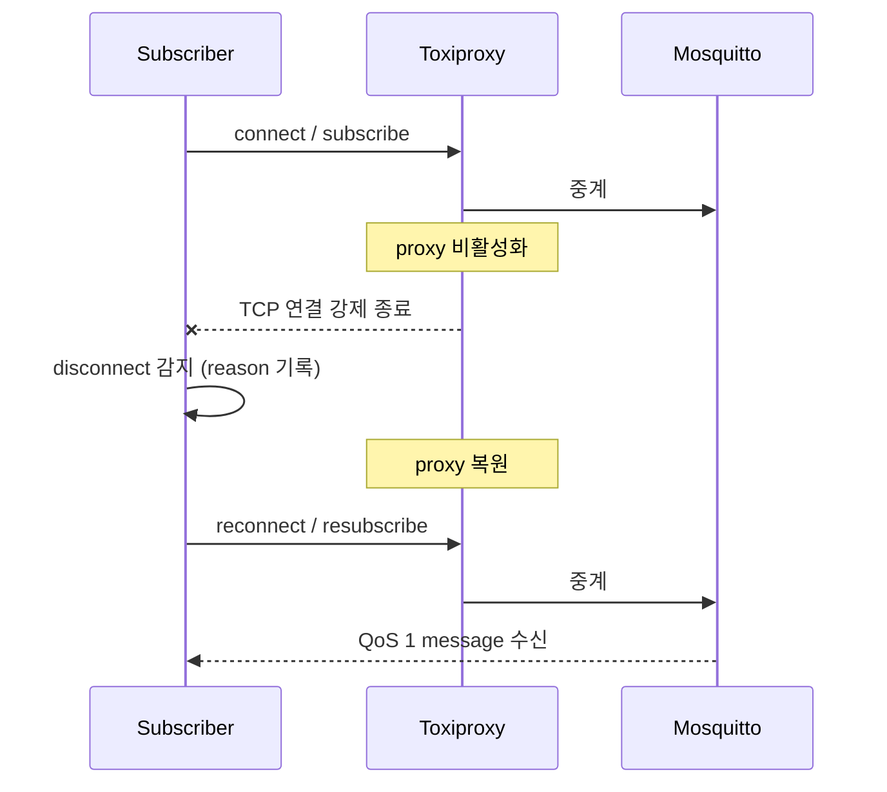

# MQTT Protocol Validation

YAML 시나리오를 읽어 Mosquitto에 publisher와 subscriber를 구성하고, Expected와 Observed를 비교해
합불을 자동으로 판정하는 MQTT 검증 도구입니다. 판정 근거는 JSON 요약, JUnit XML, JSONL 이벤트 로그로 남습니다.

화면보다 재현성과 추적성, 자동 판정을 우선해 설계했습니다.

| 항목 | 결과 |
|---|---|
| 테스트케이스 | 기본 10개 · 장애 복구 2개 · 의도적 실패 1개 |
| pytest | 22 passed ([GitHub Actions](https://github.com/minzoo-kim/mqtt-protocol-validation/actions/runs/34199471545), `503f1a8`) |
| YAML suite | 기본 10 passed · 복구 2 passed · 의도적 실패 1 failed (exit code 1) |
| 반복 안정성 | 복구 suite 20회 반복, 총 40 케이스 failure 0 |
| statement coverage | 83.71% (GitHub Actions, 게이트 80%) |

검증 환경은 Windows ARM64, Python 3.12, Docker Desktop이며 Mosquitto 2.x와 Toxiproxy 2.12.0을 사용했습니다.
최신 CI는 Ubuntu와 Python 3.12에서 단위·통합 테스트 22개, 기본 suite 10개와 복구 suite 2개를 통과했습니다.
상세 증적은 [`docs/evidence/RESILIENCE_VALIDATION_2026-08-31.md`](docs/evidence/RESILIENCE_VALIDATION_2026-08-31.md)와
machine-readable [`resilience-validation-summary.json`](docs/evidence/resilience-validation-summary.json)에 있습니다.

MQTT 용어부터 실행, 결과 확인, GitHub Actions 연동까지는
[`docs/TECHNICAL_GUIDE_KO.md`](docs/TECHNICAL_GUIDE_KO.md)에 순서대로 정리했습니다.

---

## 시스템 구성



---

## 검증 범위

- QoS 0/1/2 정상 경로와 publisher·subscriber 간 QoS 협상
- retained message와 나중에 접속한 subscriber의 수신 여부
- 동일 `message_id`를 가진 애플리케이션 중복 메시지 탐지
- malformed JSON 거부와 구체적인 파싱 실패 사유 분류
- 메시지 미수신 timeout의 정상 판정
- 명시적 disconnect 이후 reconnect와 재구독, 메시지 수신
- `clean_session=false` persistent session과 오프라인 QoS 1 queue 복원
- Toxiproxy로 기존 TCP 연결을 강제로 끊고 disconnect 감지·재연결·재구독·수신 복구
- 비일치 topic의 격리
- Expected/Observed 기반 자동 판정과 의도적 실패 재현

QoS 0 테스트는 손실 가능성이 있는 프로토콜의 전달 보장을 주장하지 않고, 정상 연결 상태에서 한 번 전달되는지를 관측합니다.
QoS 2 테스트 역시 패킷 캡처로 4단계 핸드셰이크를 검사하는 것이 아니라 subscriber가 메시지를 한 번 관측하는지를 검증합니다.

---

## 빠른 실행

요구 환경은 Python 3.11 이상과 Docker Desktop(Docker Compose v2 포함)입니다.

```powershell
python -m venv .venv
.\.venv\Scripts\Activate.ps1
python -m pip install -e ".[dev]"
docker compose up -d --wait
python -m mqtt_validator run scenarios/mvp.yaml --output-dir reports
python -m mqtt_validator run scenarios/resilience.yaml --output-dir reports
```

종료:

```powershell
docker compose down
```

Linux와 macOS에서는 활성화 명령만 `source .venv/bin/activate`로 바꾸면 됩니다.

실행하면 다음과 같이 표시됩니다.

```text
Running 10 scenarios against 127.0.0.1:1883
Result: 10 passed, 0 failed, total 10
JSON:  reports/mqtt-report-...json
JUNIT: reports/mqtt-report-...xml
JSONL: reports/mqtt-report-...jsonl
```

---

## 시나리오 작성 형식

```yaml
- id: TC-MQTT-002
  requirement_id: REQ-MQTT-QOS1
  name: QoS 1 acknowledged delivery
  kind: publish_receive
  topic: validator/{run_id}/qos1
  qos: 1
  subscribe_qos: 1
  timeout_s: 2.0
  payload:
    message_id: qos1-{run_id}
    value: 20
  expected:
    received_count: 1
    delivered_qos: 1
    payload_matches: true
```

`{run_id}`는 실행마다 고유 값으로 치환되므로, 이전 실행의 retained message나 동시에 실행되는 작업이 결과를 오염시키지 않습니다.
알 수 없는 시나리오 종류, 잘못된 QoS, 중복 TC ID, 빈 Expected는 실행 전에 거부됩니다.

---

## 요구사항-테스트케이스 추적표

| 요구사항 ID | 테스트케이스 | 판정 기준 |
|---|---|---|
| REQ-MQTT-QOS0 | TC-MQTT-001 | 정상 연결에서 QoS 0 메시지 1건과 payload 일치 |
| REQ-MQTT-QOS1 | TC-MQTT-002 | QoS 1 메시지 1건과 payload 일치 |
| REQ-MQTT-QOS2 | TC-MQTT-003 | QoS 2 메시지가 subscriber에 1건 관측 |
| REQ-MQTT-RETAIN | TC-MQTT-004 | publish 이후 접속한 subscriber가 retain flag와 상태 수신 |
| REQ-MQTT-DUPLICATE | TC-MQTT-005 | 원본 2건, 고유 ID 1건, 중복 1건으로 집계 |
| REQ-MQTT-PAYLOAD | TC-MQTT-006 | malformed JSON을 `JSONDecodeError`로 분류 |
| REQ-MQTT-TIMEOUT | TC-MQTT-007 | 제한 시간 동안 메시지 0건이면 expected timeout |
| REQ-MQTT-RECONNECT | TC-MQTT-008 | disconnect·reconnect와 재구독 뒤 메시지 1건 수신 |
| REQ-MQTT-TOPIC | TC-MQTT-009 | 다른 topic의 메시지는 수신하지 않음 |
| REQ-MQTT-QOS-NEGOTIATION | TC-MQTT-010 | publish QoS 2 · subscribe QoS 1이면 전달 QoS 1 |
| REQ-MQTT-PERSISTENT-SESSION | TC-MQTT-R001 | 재구독 없이 기존 session을 복원해 오프라인 QoS 1 메시지 수신 |
| REQ-MQTT-CONNECTION-CUT-RECOVERY | TC-MQTT-R002 | TCP cut 감지 후 proxy 복원·재접속·재구독하여 메시지 수신 |

원본 테스트 데이터는 [`scenarios/mvp.yaml`](scenarios/mvp.yaml)과 [`scenarios/resilience.yaml`](scenarios/resilience.yaml)에 있습니다.

---

## 장애 주입과 복구 검증

Toxiproxy를 subscriber와 Mosquitto 사이에 놓고, 이미 연결된 상태에서 proxy를 비활성화합니다.
실제 TCP 연결이 닫히면서 Paho callback에 비정상 disconnect가 전달되고, 이후 proxy를 복원해
재연결과 재구독, 메시지 수신까지 자동으로 판정합니다.



`disconnect()` 함수를 호출하는 시험보다 실제 네트워크 단절에 가깝습니다.
다만 packet loss나 latency를 주입하는 시험은 포함하지 않았습니다.

paho 콜백 스레드와 메인 스레드 사이의 대기와 전달은 `threading.Event`와 `queue.Queue`로 처리해,
타임아웃이 있는 결정적 판정이 가능하도록 했습니다.

---

## 결과 리포트

실행할 때마다 `reports/` 아래에 세 파일이 생성됩니다. 소비자가 다르기 때문에 형식을 나눴습니다.

| 파일 | 용도 |
|---|---|
| `*.json` | 실행 전체 요약과 TC별 Expected/Observed를 사람이 검토하거나 후속 도구에 전달 |
| `*.xml` | GitHub Actions 같은 CI가 테스트 성공·실패를 표준 형식으로 표시 |
| `*.jsonl` | 연결·구독·발행·수신·timeout·판정의 시간 순서를 한 줄씩 추적해 장애 원인을 분석 |

CLI는 실패가 하나라도 있으면 종료 코드 1을 반환합니다. 실패를 재현하면서 리포트만 만들 때는 다음처럼 실행합니다.

```powershell
python -m mqtt_validator run scenarios/failure_demo.yaml --output-dir reports --allow-failures
```

실패 로그 예시:

```json
{"run_id":"20260831T120000-a1b2c3d4","case_id":"TC-MQTT-FAIL-001","requirement_id":"REQ-MQTT-QOS1","stage":"case_result","details":{"status":"failed","expected":{"received_count":1,"delivered_qos":2,"payload_matches":true},"observed":{"received_count":1,"delivered_qos":1,"payload_matches":true},"mismatches":["delivered_qos: expected 2, observed 1"],"error":null}}
```

---

## 테스트와 CI

```powershell
# 단위 테스트 (브로커 연동 테스트는 자동 skip)
pytest

# 로컬 Mosquitto를 포함한 전체 통합 테스트
$env:MQTT_INTEGRATION="1"
pytest

# retained state 누수와 비결정적 race를 찾는 20회 반복 시험
python scripts/stability_check.py --runs 20

# connection cut과 persistent session을 20회 반복
python scripts/stability_check.py --suite scenarios/resilience.yaml --runs 20
```

GitHub Actions는 Mosquitto와 Toxiproxy를 Docker Compose로 시작하고, 단위·통합 테스트와
기본 10개·복구 2개 YAML 시나리오를 실행한 뒤 리포트를 artifact로 보존합니다.
실패하면 두 서비스의 로그도 출력합니다. coverage가 80% 미만이면 CI를 실패시키는 품질 게이트를 설정했습니다.

CI 워크플로는 `GITHUB_TOKEN`에 `contents: read` 권한만 부여하고, checkout에서 자격증명을
보존하지 않습니다. 사용하는 Action은 태그 대신 커밋 SHA로 고정해 동일 코드가 실행되도록 했습니다.
로컬 검증용 Mosquitto와 Toxiproxy 포트는 `127.0.0.1`에만 바인딩합니다.

---

## 디렉터리

```text
.
├── docker/                  # Mosquitto·Toxiproxy 로컬 검증 설정
├── scenarios/               # 기본·복구·의도적 실패 스위트
├── scripts/                 # 반복 안정성 검사
├── src/mqtt_validator/      # YAML 로더, MQTT probe, 판정기, 리포터, CLI
├── tests/                   # 단위 및 broker 통합 테스트
├── docs/
│   ├── TECHNICAL_GUIDE_KO.md # 용어부터 실행·CI까지의 기술 설명
│   └── evidence/             # 실행 증적과 machine-readable 요약
├── .github/workflows/ci.yml
└── docker-compose.yml
```

---

## 검증 범위의 경계

현재 범위에 다음은 포함되지 않습니다.
웹 대시보드, 실제 차량 ECU 및 HIL, CAN·SOME/IP·DDS, TLS와 인증·ACL, MQTT 5 reason code,
broker 프로세스 강제 종료와 재기동, packet loss 및 latency 주입, MQTT DUP flag 강제 재현.

connection cut은 Toxiproxy를 비활성화해 기존 TCP 연결을 닫는 결정적 시험이며,
persistent session은 동일 Python client 객체의 reconnect 범위에서 검증합니다.

Toxiproxy는 [Shopify의 공식 Toxiproxy 프로젝트](https://github.com/Shopify/toxiproxy),
persistent session 동작은 [Eclipse Paho Python client 문서](https://eclipse.dev/paho/files/paho.mqtt.python/html/client.html)를 기준으로 구현했습니다.

---

## 라이선스

이 저장소의 코드는 [MIT License](LICENSE)로 제공합니다.
